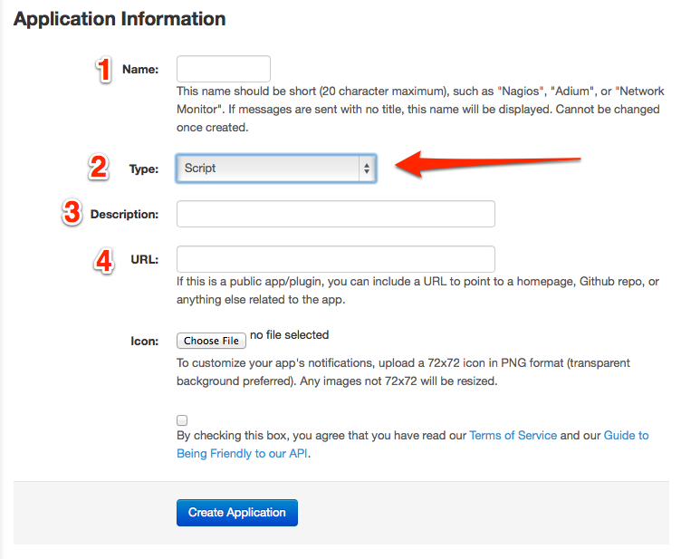

po.sh: **[P]**ush**[O]**ver **[SH]**ell script
====

## *What is Pushover?*

[Pushover][] is a web service to send messages from a computer to an iOS (or Android) device.

   [Pushover]: https://pushover.net/

Previously I was using [Prowl][], but Pushover has a richer feature set and looks nicer, which is what gave me the idea to call my script *[posh][]*.

   [Prowl]: http://prowlapp.com/
   [posh]: https://www.google.com/search?q=+define+posh

### *What is `po.sh`?*

`posh` is a simple shell script that I wrote which uses the [Pushover REST API](https://pushover.net/api)  to easily send messages to myself from other shell scripts.

For example, if I have a `cron` or `launchd` job that runs every night or every week, and I want to know that it was successful, I can just add this to the bottom of the script before the `exit`:

		po.sh "$0 exited successfully"

That way I don’t need to worry about getting all of the Pushover API details right every time I want to write a shell script which sends a message using Pushover.

Also, `po.sh` will automatically add the `hostname` and `time` to the end of the message, so I’ll never have to wonder “Which computer sent me this message?”

### Before You Can Use This… ###

In order to use this script, you will need to:

*	Sign up for a free account at <https://pushover.net/login> .
*	Fill out the form at <https://pushover.net/apps/build> to register this script and get your personalized Pushover “Token”.

You will see a form like this:

You _might_ be able to use `po.sh` for the "Name" in the first field, but I would not be surprised to learn that Pushover requires every application to have a unique name. If so just call it something else.

*Make sure* that you choose "Script" from the “Type” drop down (item #2 in the image). Fill in whatever you want for #3 and #4. You will then need to choose an image to use as an icon, and then check the box to agree to the TOS.

### Once You Have Your Own Pushover Token… ###

Launch the Pushover app on your iPad or iPhone/iPod touch (or Android device) and find the User Key which is specific to that device. (It is *not* the same thing as your *user name* on the Pushover website!)

Then you need to add your Token and User Key somewhere that `po.sh` can find it. There are four options:

1.	Put the two lines inside the `po.sh` file itself. This is the easiest method, assuming that you are not going to post your version of `po.sh` to Github or anywhere that someone might see it, because then they could send you messages and use your API quota.
2.	Put the two lines inside ~/.zshenv because `po.sh` is a zsh script and therefore it will read ~/.zshenv before it runs.
3.	Put the two lines inside a plain text file at `"$HOME/Dropbox/etc/posh.txt"`
4.	Redefine `POSH_FILE=` in `po.sh` to point to a file other than `"$HOME/Dropbox/etc/posh.txt"` and put the two lines inside a plain text file there.

Which two lines? These two:

		PUSHOVER_TOKEN='tttttttttttttt'

		PUSHOVER_USER_KEY='uuuuuuuuuuuu'

Obviously you want to change `tttttttttttttt` to the token you received when you created the “application" on Pushover’s website, and change `uuuuuuuuuuuu` to whatever your User Key actually is, as shown in the settings of the Pushover app on your iOS or Android device. Just make sure that it starts and ends with a straight `'` and that there are no spaces on either side of the `=` and that `PUSHOVER_TOKEN` and `PUSHOVER_USER_KEY` are both uppercase with `_` in the right places, as shown.

*(Sorry to be so specific and step-by-step, but I’m trying to imagine someone who is new at this and isn’t sure what to do. On the other hand, most people reading code on Github probably know how to do this.)*

